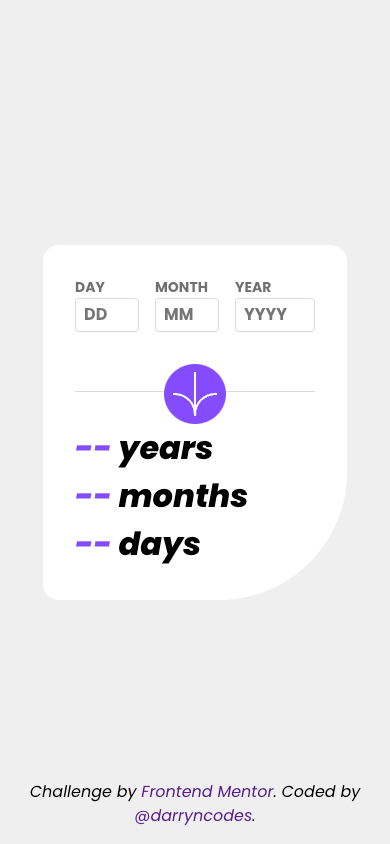

# Frontend Mentor - Age calculator app solution

This is a solution to the [Age calculator app challenge on Frontend Mentor](https://www.frontendmentor.io/challenges/age-calculator-app-dF9DFFpj-Q). Frontend Mentor challenges help you improve your coding skills by building realistic projects.

## Table of contents

-   [Overview](#overview)
    -   [The challenge](#the-challenge)
    -   [Screenshot](#screenshot)
    -   [Links](#links)
-   [My process](#my-process)
    -   [Built with](#built-with)
    -   [Useful resources](#useful-resources)
-   [Author](#author)

## Overview

### The challenge

Users should be able to:

-   View an age in years, months, and days after submitting a valid date through the form
-   Receive validation errors if:
    -   Any field is empty when the form is submitted
    -   The day number is not between 1-31
    -   The month number is not between 1-12
    -   The year is in the future
    -   The date is invalid e.g. 31/04/1991 (there are 30 days in April)
-   View the optimal layout for the interface depending on their device's screen size
-   See hover and focus states for all interactive elements on the page
-   **Bonus**: See the age numbers animate to their final number when the form is submitted

### Screenshot

### Links

-   [GitHub repo](https://github.com/darryncodes/age-calculator-app)
-   [Live URL](https://darryncodes.github.io/age-calculator-app/)

## My process

### Built with

-   Semantic HTML5 markup
-   Mobile-first workflow
-   [React](https://reactjs.org/) - JS library
-   [Styled Components](https://styled-components.com/) - For styles

### Useful resources

-   [Day.js - Fast 2kB alternative to Moment.js with the same modern API](https://day.js.org/) - This helped me to validate the inputted date.
-   [String.prototype.padStart()](https://developer.mozilla.org/en-US/docs/Web/JavaScript/Reference/Global_Objects/String/padStart) - I used this method to ensure that right date format was entered with or without a leading 0 to ensure the Day.js validation could work correctly.
-   [Brad Traversy - Styled Components Crash Course](https://www.youtube.com/watch?v=02zO0hZmwnw) - Brad doing what he does best, a great overview of using styled components with React.

## Author

-   Website - [darryn.dev](https://darryn.dev)
-   Frontend Mentor - [@darryncodes](https://www.frontendmentor.io/profile/darryncodes)
-   Twitter - [@darryncodes](https://twitter.com/darryncodes)
